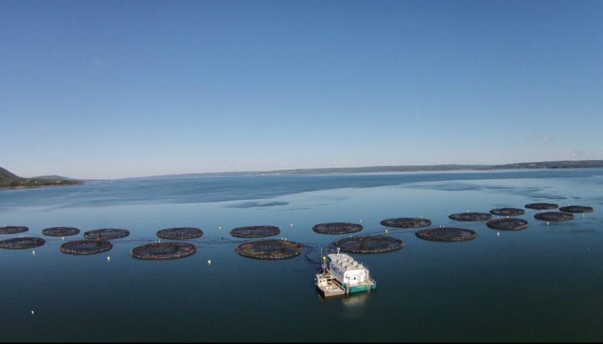

[Interaction of aquaculture with lobster fishery](https://www.cbc.ca/news/canada/new-brunswick/aquaculture-company-on-the-hook-for-500k-for-pesticide-use-1.1317105#:~:text=Aquaculture%20company%20on%20the%20hook%20for%20%24500K%20for,AM%20AT%20%7C%20Last%20Updated%3A%20April%2026%2C%202013)

[Defining Lobster Fishermen Concern for Finfish Aquaculture on Lobsters and Lobster Fishing Communities in Nova Scotia: A Pilot Study](https://novascotia.ca/fish/Defining_Lobster_Fisherman_Concerns_-_U_Sainte_Anne.pdf){.uri}

[Impact of Aquaculture on Commercial Fisheries: Fishermen's Local Ecological Knowledge](10.1007/s10745-011-9450-7)

[Resource map for Marine users - Aquaculture in NS](https://cmar.ca/resource-map-for-marine-users/)

